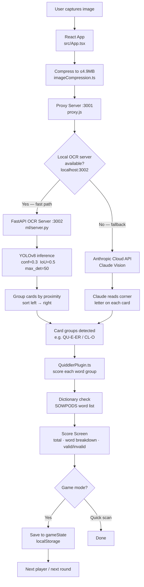
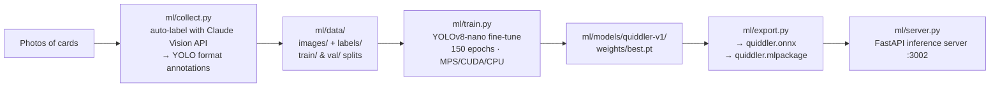

# How TallySnap Works

TallySnap scans a Quiddler card hand with your camera and automatically scores it. It uses a local YOLOv8 model for fast offline recognition, falling back to the Claude Vision API when the local model isn't running.

---

## Runtime Flow

---

## ML Training Pipeline

The local YOLOv8 model is trained on photos of real Quiddler cards. Claude Vision auto-generates the bounding-box labels so no manual annotation is needed.

**31 card classes:** A–Z plus the double-letter cards TH · QU · IN · ER · CL

---

## Key Files

| File | Role |
|---|---|
| `src/App.tsx` | React UI, game state, round/player flow |
| `src/services/visionApi.ts` | Sends image to proxy, parses card groups |
| `src/services/imageCompression.ts` | Reduces image to ≤4.9MB before upload |
| `src/plugins/QuiddlerPlugin.ts` | Card point values, word scoring rules |
| `proxy.js` | Routes to local OCR server or Anthropic API |
| `ml/collect.py` | Auto-labels card photos using Claude Vision |
| `ml/train.py` | Fine-tunes YOLOv8 on labeled card images |
| `ml/export.py` | Exports model to ONNX / CoreML |
| `ml/server.py` | FastAPI server wrapping YOLOv8 inference |
| `ml/dataset.yaml` | YOLO dataset config — 31 class names & paths |
